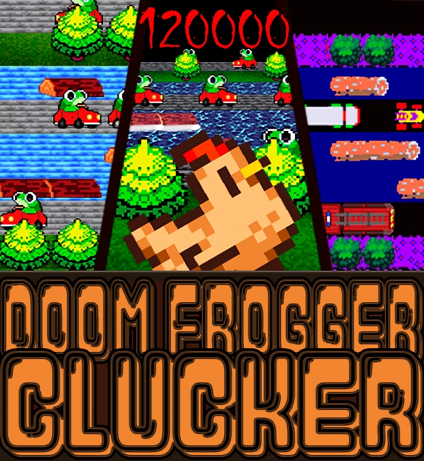

Immerse yourself in a third-person, procedurally generated world, assuming the role of a wandering protagonist in pursuit of achieving the utmost score in the captivating game of "DOOM FROGGER CLUCKER".
This project was assigned with the intention of furthering my familiarity with [Haskell](https://www.haskell.org/) and its library [Gloss](http://gloss.ouroborus.net/).

#
# Try it out for yourself! 

###    [1. Install GHC and cabal](https://www.haskell.org/downloads/)

###    2. Install all necessary libraries (Gloss) 

    cabal update
    cabal install --lib gloss
        
    
###    3. Get this repository's content into some directory

    git clone https://github.com/pedrofp4444/Crossy-Road-Plus.git
        

###    4. Get into the [src](src/) directory

    cd LI1-Clucker/src
    

###    5. Compile

    ghc Main.hs

###    6. PLAY!

    
    ./Main
    

 (if for some reason you ended up with some error/something missing ... my bad G 😔👍)
#
# How does this work? 

### 1. 🐋Haddock🐋

    cd ..
    cabal haddock --haddock-all
    haddock -h -o doc/html src/*.hs

### 2. Click on doc/html/index.html

 (again, if for some reason you ended up with some error/something missing ... my bad G 😔👍)
#

## Final Grade 🥚 **17/20** 🥚

(Last Update: January 2nd) [1st Year|1st Semester]